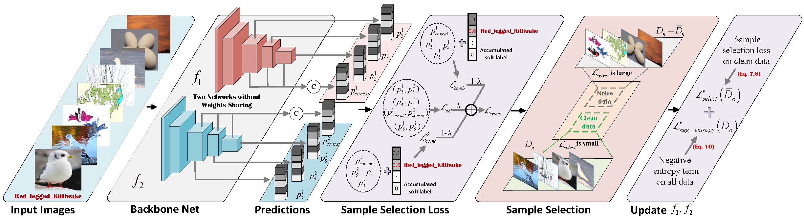

This is the PyTorch implementation for our **MS-DeJoR**

## Network Architecture
The architecture of our proposed MS-DeJoC model is as follows


## Setups
 - **Environment**
    Create a virtual environment of python 3.7,

  `$ conda create -n msdejor_env python=3.7`

  `$ conda activate msdejor_env`

  Install all dependencies

   `$ pip install -r requirements.txt` 

 - **Data Preparation**
    Download these web fine-grained datasets, namely [Web-CUB](https://wsnfg-sh.oss-cn-shanghai.aliyuncs.com/web-bird.tar.gz), [Web-Car](https://wsnfg-sh.oss-cn-shanghai.aliyuncs.com/web-car.tar.gz) and [Web-Aircraft](https://wsnfg-sh.oss-cn-shanghai.aliyuncs.com/web-aircraft.tar.gz). Then uncompress them into `./data` directory.

  ```
  data
  ├── web-bird
  │   ├── train
  │   └── val
  ├── web-car
  │   ├── train
  │   └── val
  └── web-aircraft
      ├── train
      └── tval
  ```

## Running
If you want to use multi-scale module,  modify the corresponding parameters in `main_msdejor.py`, such as `--bs`, `--net`, `--data`, `--gpu`, etc. You can also directly run `main_msdejor.py` to get the final result.

```python
python main_msdejor.py --bs 32 --net 18 --data bird --lamb 0.1 --gama 2
```

If you only prefer theDeJoR module,  run `main_dejor.py`.

```python
python main_dejor.py --bs 64 --net 18 --data bird --lamb 0.1 --gama 2
```


## Results
